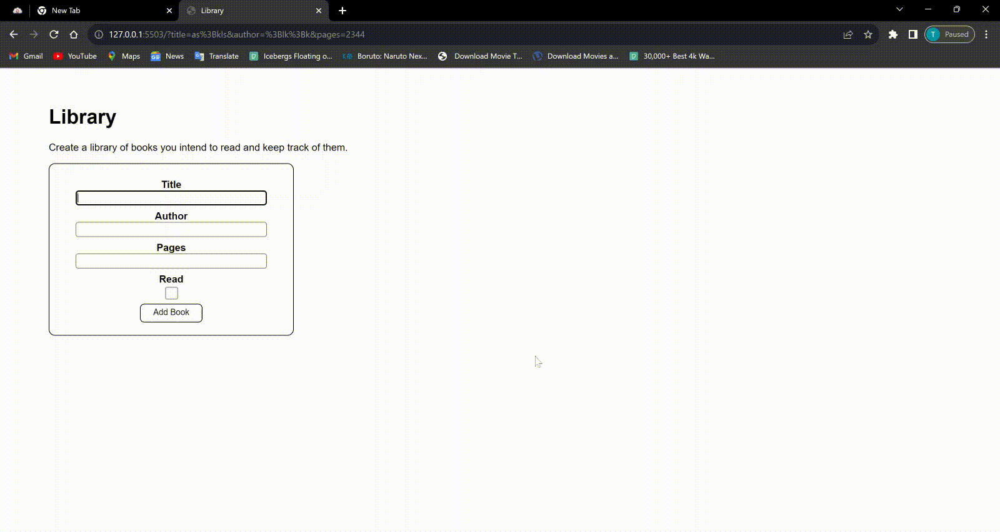

# Library App Project

This is my Library App project, which I created as part of The Odin Project curriculum. The goal of this project is to develop a web-based application for managing my personal book collection. With this app, I can easily add books, remove books, and toggle their read status. Additionally, I have implemented local storage to ensure that my book collection remains intact even when I refresh the page.

## Features

1. **Add a Book**: I can effortlessly add new books to my library by providing the title, author, number of pages, and marking their read status.

2. **Remove a Book**: If I decide I no longer want to keep a book in my library, I can remove it with a single click.

3. **Toggle Read Status**: I can keep track of which books I've read and which ones I haven't by toggling the read status of each book.

4. **Local Storage**: My book collection is stored locally, so even if I refresh the page or close my browser, my library will remain intact.

## Demo

## Future Enhancements

I have plans to further enhance the aesthetics and add more features to my library app in the future. Some of the planned enhancements include:

- **Improved User Interface (UI)**: Enhancing the design and layout of the app for a more visually appealing and user-friendly experience.

- **Search and Sorting**: Implementing search and sorting functionality to help me easily find and organize my books.

- **Categories and Tags**: Allowing me to categorize and tag books for better organization and filtering.

- **User Authentication**: Adding user authentication to enable multiple users to have their own separate libraries.

- **Book Details**: Displaying additional details about each book, such as cover images and publication dates.

## Technologies Used

- HTML
- CSS
- JavaScript
- Local Storage API
